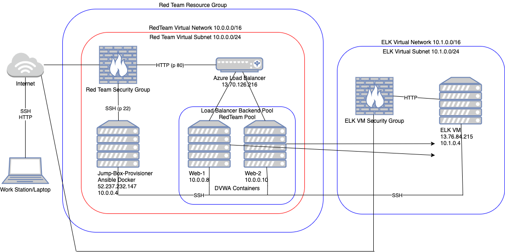
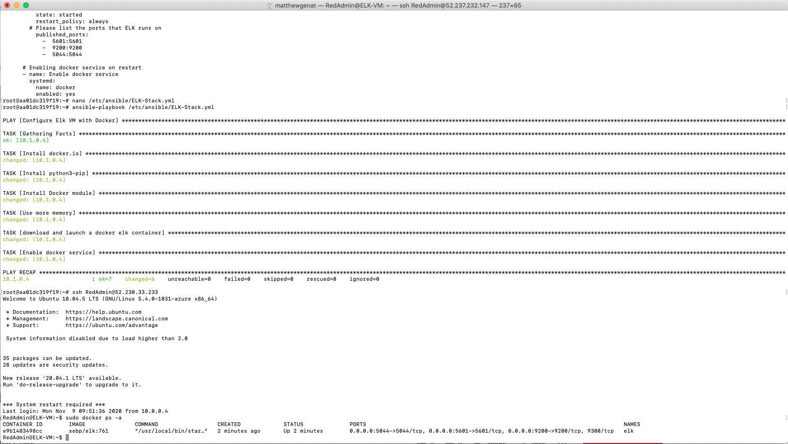

## Automated ELK Stack Deployment

The files in this repository were used to configure the network depicted below.

These files have been tested and used to generate a live ELK deployment on Azure. They can be used to either recreate the entire deployment pictured above. Alternatively, select portions of the YAML file may be used to install only certain pieces of it, such as Filebeat.

  
  

This document contains the following details:
- Description of the Topologu
- Access Policies
- ELK Configuration
  - Beats in Use
  - Machines Being Monitored
- How to Use the Ansible Build

### Description of the Topology

The main purpose of this network is to expose a load-balanced and monitored instance of DVWA, the Dmn Vulnerable Web Application.

Load balancing ensures that the application will be highly available, in addition to restricting access to the network.
- It protects your data networks from DDos attacks.

Integrating an ELK server allows users to easily monitor the vulnerable VMs for changes to the  and system logs.
- Filebeat monitors log files that you specify and forwards them to Elasticsearch or Logstach.
- Metricbeat periodically collects the metrics and statistics from your OS then outputs what you specify to the Elasticssearch or Logstach.

The configuration details of each machine may be found below.
_Note: Use the [Markdown Table Generator](http://www.tablesgenerator.com/markdown_tables) to add/remove values from the table_.

| Name     | Function | IP Address                                 | Operating System |
|----------|----------|--------------------------------------------|------------------|
| Jump Box | Gateway  | 52.237.232.147(Public)/10.0.0.4(Private)   | Linux            |
| Web-1    | Server   | 10.0.0.8(Private)                          | Linux            |
| Web-2    | Server   | 10.0.0.10(Private)                         | Linux            |
| ELK-VM   | Server   | 13.76.84.215(Public)/10.1.0.4(Private)     | Linux            |

### Access Policies

The machines on the internal network are not exposed to the public Internet. 

Only the Jumpbox Provisioner machine can accept connections from the Internet. Access to this machine is only allowed from the following IP addresses:
- 123.208.254.53 (LocalHost IP Address)

Machines within the network can only be accessed by JumpBox Provisioner.
- The JumpBox Provisioner with IP 10.0.0.4 (Private)

A summary of the access policies in place can be found in the table below.

| Name     | Publicly Accessible | Allowed IP Addresses |
|----------|---------------------|----------------------|
| Jump Box | Yes                 | 123.208.254.53       |
| Web-1    | No                  | 10.0.0.4             |
| Web-2    | No                  | 10.0.0.4             |
| ELK-VM   | No                  | 10.0.0.4             |

### Elk Configuration

Ansible was used to automate configuration of the ELK machine. No configuration was performed manually, which is advantageous because...
- The main benefit of Ansible is to allows IT admins to automate the setup of multiple machines with one file.

The playbook implements the following tasks:
- Installed Docker.io and Python3.pip
- Installed the Docker module
- Increased memory on the ELK-VM
- Download and install a docker elk container sebp/elk:761 to run on specific ports
- Enabled docker services on start up

The following screenshot displays the result of running `docker ps` after successfully configuring the ELK instance.

### Target Machines & Beats
This ELK server is configured to monitor the following machines:
- Web-1 VM 10.0.0.8 (Private)
- Web-2 VM 10.0.0.10 (Private)

We have installed the following Beats on these machines:
- Documents/BootcampCybersecurity/Homework/Project-1/Filebeat-Screenshot.png
- Documents/BootcampCybersecurity/Homework/Project-1/Metricbeat-Screenshot.png

These Beats allow us to collect the following information from each machine:
- Filebeat is used to collect log files from the 2 specified VM's Web-1 and Web-2
- Example of what logs Filebeats module collects is audit logs, depeciation logs, server logs, garbage collection logs and slow logs
- Metricbeat is used to periodically collect metrics of the OS and from services running on the server.
- Examples of what metrics and statistics it collects from is Apache, HAProxy, MongoDB, MySQL, Nginx, PostgreSQL, Redis, System and Zookeeper

### Using the Playbook
In order to use the playbook, you will need to have an Ansible control node already configured. Assuming you have such a control node provisioned: 

SSH into the control node and follow the steps below:

--Filebeat--

- Copy the filebeat-config.yml file to /etc/ansible/files/
- Update the filebeat-config.yml file to include the IP Address of the ELK-VM 10.1.0.4:9200
- Run the playbook, and navigate to http://13.76.84.215:5601/app/kibana to check that the installation worked as expected.

--Metricbeat---

- Copy the metricbeat-config.yml file to /etc/ansible/files/
- Update the metricbeat-config.yml file to include the IP Address of the ELK-VM 10.1.0.4:9200
- Run the playbook, and navigate to http://13.76.84.215:5601/app/kibana to check that the installation worked as expected.

_TODO: Answer the following questions to fill in the blanks:_
- Which file is the playbook? filebeat-playbook.yml & metricbeat-playbook.yml
- Where do you copy it? /etc/ansible/roles/
- Which file do you update to make Ansible run the playbook on a specific machine? Update /etc/ansible/hosts 
- How do I specify which machine to install the ELK server on versus which to install Filebeat on? Update [webservers] to include Web-1 & Web-2 VMs
- Which URL do you navigate to in order to check that the ELK server is running? http://13.76.84.215:5601/app/kibana
